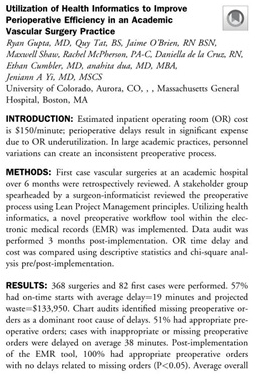

## INTRO
Medical informatics or health informatics is the intersection of technology and the healthcare’s system. Health informatics assists in both surgical procedures and the creation of electronic patient records and databases. As the field of health informatics and surgery has expanded over time, it has evolved into several distinct areas of study. Some notable branches of study within the realm of health informatics and surgery include clinical health informatics, health informatics and surgery, and the application of health informatics in surgical procedures.

### ADVANTAGES
Record Keeping
Health informatics in surgery provides numerous benefits, one of which is the ability to maintain more accurate and efficient record keeping. The use of electronic health records allows for a better understanding and overview of a patient's medical history, which is accessible to surgeons and other healthcare providers in real-time. This can aid in preventing medical errors and improving patient safety by giving a complete and updated picture of the patient's medical history and current health status.(Photo 1)

### Surgical Planning
Another important benefit of health informatics in surgery is its ability to assist in the preparation and planning of surgical procedures. The utilization of computer simulations, Artificial Intelligence, and other digital tools allows surgeons to virtually practice and visualize an operation before performing it in the real-world scenario. This can greatly aid in reducing errors and enhance the outcomes of the surgical procedures. Additionally, health informatics can also help in identifying potential complications, and how to manage them, during the preparation phase, which also leads to better patient outcomes. Furthermore, the use of health informatics in surgery can also help in reducing the surgical time, and allow for more accurate and precise surgical movements, and post-surgery recovery can also be improved with the help of data-driven and evidence-based approach.

### Computer Assisted Surgery
One particular way in which health informatics is being utilized in surgery is through the implementation of computer-assisted surgery (CAS). CAS refers to the use of computer technology to assist in the execution of a surgical procedure. This can encompass the utilization of robots to perform the surgery, or the use of computer programs to guide the surgeon during the procedure. CAS has the potential to significantly improve the accuracy and precision of surgeries, as well as reduce the likelihood of complications. Additionally, CAS can also improve the patient outcomes by reducing the invasiveness of the surgery, minimizing the surgical trauma, and also reducing the surgical time. Furthermore, CAS can also be used to enhance the precision of the surgical instruments, allowing for more accurate and precise movements. CAS is also being used to improve the visualization of the surgical site, and to support the surgeon with real-time data-driven information. By using CAS, the surgeon can also have access to the patient's medical history, and current health status, which can be helpful in making informed decisions during the surgery.

## CONCLUSION
To sum-up, health informatics helps surgeons significantly in assisting, planning and executing surgical procedures also, it improves patient outcomes and increase accuracy and precision of surgeries using CAS. As healthcare systems continue to adopt and integrate technology into their operations, the role of health informatics will only continue to grow and evolve. 

### REFERENCES

Health Informatics And Surgery|OMICS International|Journal Of Health And Medical InfoInformatics (omicsonline.org)

Journal of the American College of Surgeons 233(5):p e94-e95, November 2021. | DOI: 10.1016/j.jamcollsurg.2021.08.251

how to add a picture:  you have to upload picture into repo
